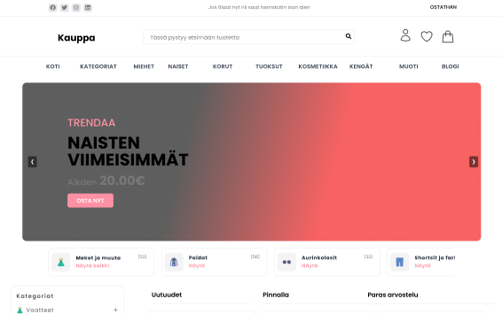
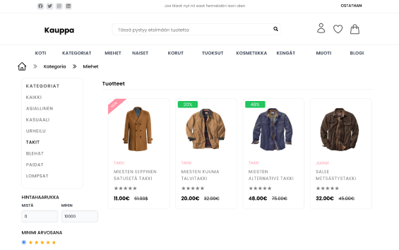
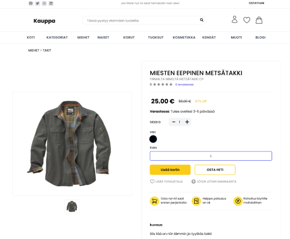
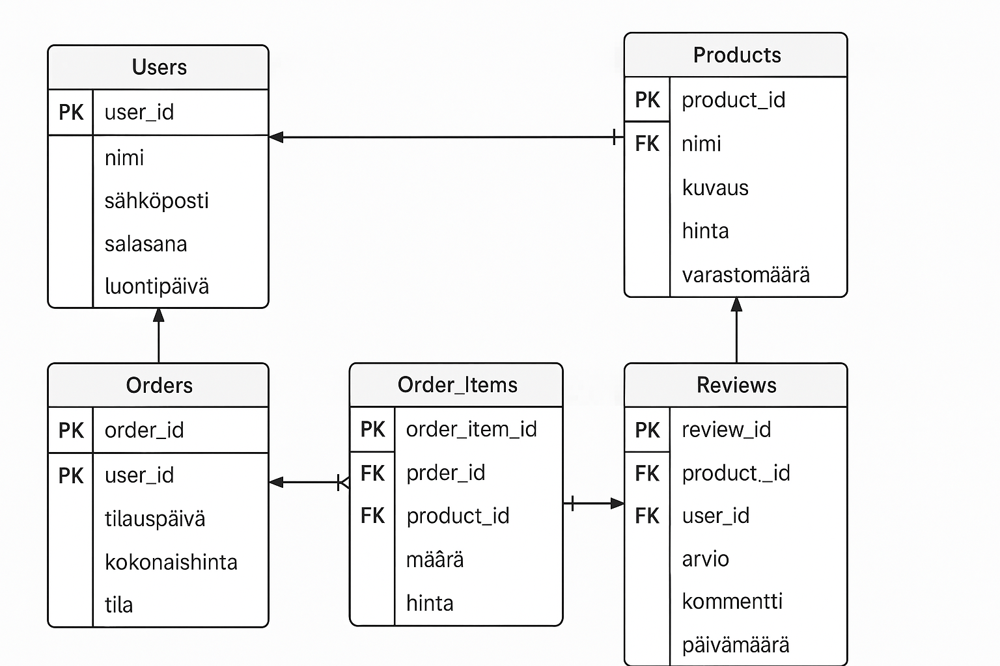

# vaihe 1 - Määrittely ja suunnittelu

Mitäs tähän nyt sitte, tarkoitus rakennella pilvessä olevan PERN -stackillä tehty verkkokauppa

## 1. Käyttäjäpersoonat

Mahdollisia käyttäjiä ja hieman heistä jotta ymmärrretään miten käyttö saattaa erota:

### 1 Anna – Aktiivinen verkkoshoppailija

- Ikä: 30 vuotta​
- Ammatti: Markkinointikoordinaattori​
- Tausta: Anna tekee usein verkko-ostoksia kiireisen aikataulunsa vuoksi. Hän arvostaa käyttäjäystävällisiä verkkokauppoja, joissa on laaja tuotevalikoima ja sujuva maksuprosessi.​

#### Tarpeet ja tavoitteet:
- Nopea ja helppo navigointi tuotteiden välillä.
- Turvalliset ja monipuoliset maksuvaihtoehdot.
- Mahdollisuus seurata tilauksia reaaliaikaisesti.

#### Haasteet:
- Löytää luotettavia tuotteita laajasta valikoimasta.
- Varmistaa, että maksutiedot ovat turvassa.

### 2 Mikko – Teknologiasta kiinnostunut ostaja

- Ikä: 25 vuotta​
- Ammatti: Ohjelmistokehittäjä​
- Tausta: Mikko on innokas seuraamaan uusimpia teknologisia trendejä ja ostaa usein elektroniikkaa verkosta. Hän arvostaa yksityiskohtaisia tuotekuvauksia ja asiakasarvioita.​

#### Tarpeet ja tavoitteet:
- Pääsy kattaviin tuotetietoihin ja teknisiin spesifikaatioihin.
- Mahdollisuus lukea ja kirjoittaa tuotearvosteluja.
- Toimiva hakutoiminto ja suodatusmahdollisuudet.

#### Haasteet:
- Varmistaa tuotteiden laatu ilman fyysistä tarkastelua.
- Löytää nopeasti haluamansa tuotteet suuresta valikoimasta.

### 3 Liisa – Satunnainen verkkokaupan käyttäjä
- Ikä: 45 vuotta​
- Ammatti: Opettaja​
- Tausta: Liisa tekee harvemmin verkko-ostoksia ja arvostaa selkeää opastusta sekä asiakaspalvelun saatavuutta. Hän ostaa pääasiassa vaatteita ja kodintarvikkeita.​

#### Tarpeet ja tavoitteet:
- Yksinkertainen rekisteröitymis- ja tilausprosessi.
- Mahdollisuus ottaa helposti yhteyttä asiakaspalveluun.
- Selkeät palautus- ja toimitusehdot.

#### Haasteet:
- Epävarmuus verkkokaupan käytöstä ja tietoturvasta.
- Tarve saada lisätietoa tuotteista ennen ostopäätöstä.

### 4 Kari – Yrittäjä ja tukkumyyjä
- Ikä: 38 vuotta​
- Ammatti: Kauppias​
- Tausta: Kari ostaa suuria määriä tuotteita yrityksensä tarpeisiin ja arvostaa alennuksia sekä joustavia maksuehtoja.​

#### Tarpeet ja tavoitteet:
- Mahdollisuus tehdä suurtilauksia helposti.
- Tiedot tukkuhinnoista ja alennuksista.
- Kattavat toimitusvaihtoehdot ja aikataulut.

#### Haasteet:
- Hallita suuria tilauksia ja varmistaa tuotteiden saatavuus.
- Neuvotella maksuehdoista ja toimitusajoista.

### 5 Sofia – Muotitietoinen opiskelija
- Ikä: 22 vuotta​
- Ammatti: Yliopisto-opiskelija​
- Tausta: Sofia seuraa aktiivisesti muotitrendejä ja tekee usein vaateostoksia verkossa. Hän arvostaa käyttäjäystävällistä mobiilikokemusta ja nopeita toimituksia.​

#### Tarpeet ja tavoitteet:
- Inspiroiva ja visuaalisesti miellyttävä käyttöliittymä.
- Helppo pääsy uusimpiin muotituotteisiin ja trendeihin.
- Nopeat ja edulliset toimitusvaihtoehdot.

#### Haasteet:
- Varmistaa tuotteiden koko ja istuvuus ilman sovitusta.
- Hallita opiskelijabudjettia ja löytää edullisia vaihtoehtoja.

## 2. Käyttötapaukset ja käyttäjävirrat

### 1 Tuotteiden selaaminen ja haku

#### Kuvaus: 
Käyttäjä voi selata tuotteita kategorioittain ja käyttää hakutoimintoa löytääkseen tiettyjä tuotteita.​

#### Esivaatimukset: 
Käyttäjä on verkkokaupan etusivulla.​

#### Miten käyttäjä uiskentelee virran mukana ja käyttää tätä:
- Käyttäjä valitsee haluamansa tuotekategorian tai syöttää hakusanan hakukenttään.
- Järjestelmä näyttää vastaavat tuotteet listana.
- Käyttäjä voi järjestää ja suodattaa tuotteita esimerkiksi hinnan tai arvostelujen perusteella.

#### Poikkeukset:
Jos hakutuloksia ei löydy, järjestelmä ilmoittaa asiasta ja ehdottaa vaihtoehtoisia tuotteita.

### 2 Tuotteen lisääminen ostoskoriin

#### Kuvaus: 
Käyttäjä lisää haluamansa tuotteen ostoskoriin.​

#### Esivaatimukset: 
Käyttäjä on tuotteen tuotesivulla.​

#### Miten käyttäjä uiskentelee virran mukana ja käyttää tätä:
- Käyttäjä valitsee tuotteen määrän ja mahdolliset variaatiot (esim. koko, väri).
- Käyttäjä klikkaa "Lisää ostoskoriin" -painiketta.
- Järjestelmä vahvistaa tuotteen lisäyksen ostoskoriin ja päivittää ostoskorin sisällön.

#### Poikkeukset:
Jos tuotetta ei ole varastossa, järjestelmä ilmoittaa asiasta eikä salli lisäystä ostoskoriin.

### 3 Ostoskoriin siirtyminen ja tilaaminen

#### Kuvaus: 
Käyttäjä tarkastelee ostoskoriaan ja tekee tilauksen.​

#### Esivaatimukset: 
Käyttäjällä on tuotteita ostoskorissa.​

#### Miten käyttäjä uiskentelee virran mukana ja käyttää tätä:
- Käyttäjä siirtyy ostoskoriin ja tarkistaa siellä olevat tuotteet.
- Käyttäjä voi muokata tuotteiden määriä tai poistaa tuotteita.
- Käyttäjä klikkaa "Siirry kassalle" -painiketta.
- Käyttäjä syöttää toimitus- ja maksutiedot.
- Käyttäjä vahvistaa tilauksen.
- Järjestelmä käsittelee tilauksen ja näyttää vahvistusviestin.

#### Poikkeukset:
Jos maksutapahtuma epäonnistuu, järjestelmä ilmoittaa asiasta ja pyytää käyttäjää yrittämään uudelleen tai valitsemaan toisen maksutavan.

### 4 Käyttäjätilin luominen ja hallinta

#### Kuvaus: 
Käyttäjä rekisteröityy palveluun ja hallinnoi omia tietojaan.​

#### Esivaatimukset: 
Käyttäjä ei ole vielä rekisteröitynyt palveluun.​

#### Miten käyttäjä uiskentelee virran mukana ja käyttää tätä:
- Käyttäjä valitsee "Rekisteröidy" -vaihtoehdon.
- Käyttäjä syöttää vaaditut tiedot (nimi, sähköposti, salasana).
- Järjestelmä luo käyttäjätilin ja lähettää vahvistusviestin sähköpostiin.
- Käyttäjä vahvistaa sähköpostiosoitteensa ja voi kirjautua sisään.
- Sisäänkirjautuneena käyttäjä voi päivittää omia tietojaan, tarkastella tilaushistoriaa ja hallita toimitusosoitteita.

#### Poikkeukset:
Jos sähköpostiosoite on jo käytössä, järjestelmä ilmoittaa asiasta ja pyytää käyttäjää kirjautumaan sisään tai käyttämään toista sähköpostiosoitetta.

### 5 Tuotearvostelun kirjoittaminen ja lukeminen

#### Kuvaus: 
Käyttäjä voi lukea muiden asiakkaiden jättämiä tuotearvosteluja ja kirjoittaa omia arvostelujaan.​

#### Esivaatimukset: 
Käyttäjä on kirjautunut sisään ja on tuotteen tuotesivulla.​

#### Miten käyttäjä uiskentelee virran mukana ja käyttää tätä:
- Käyttäjä selaa tuotesivulla olevia arvosteluja.
- Käyttäjä klikkaa "Kirjoita arvostelu" -painiketta.

## 3. Käyttöliittymän prototyypit

Noniin tässä on nopeasti figmalla tehdyt kuvat kolmesta tärkeimmästä näkymästä

### 3.1 Etusivu sivu

#### Tarkoitus: 
Tarjota yleiskatsaus verkkokaupan tarjonnasta ja helpottaa navigointia eri tuotekategorioihin.​

#### Keskeiset elementit:
- Ylänavigointipalkki: Sisältää linkit tuotekategorioihin, hakutoiminnon, asiakaspalveluun ja käyttäjätiliin.​
- Pääbanneri: Esittelee ajankohtaisia kampanjoita tai suosittuja tuotteita.​
- Suositellut tuotteet: Dynaaminen osio, joka näyttää käyttäjän aiemman selaushistorian perusteella valittuja tuotteita.​
- Uutuudet ja tarjoukset: Korostaa uusia tuotteita ja erikoistarjouksia.​

### 3.2 Tuotekategoriat-sivu 
#### Tarkoitus: 
Mahdollistaa käyttäjälle tuotteiden selaamisen valitun kategorian mukaan.​

#### Keskeiset elementit:
- Sivupalkin suodattimet: Mahdollisuus suodattaa tuotteita esimerkiksi hinnan, merkin, arvostelujen ja muiden ominaisuuksien perusteella.​
- Tuotelistaus: Näyttää valitun kategorian tuotteet ruudukkomuodossa, sisältäen tuotteen kuvan, nimen, hinnan ja lyhyen kuvauksen.​- Sivutus: Mahdollistaa suuren tuotevalikoiman selaamisen usealla sivulla.​

### 3.3 Tuotesivu 

#### Tarkoitus: 
Tarjota yksityiskohtaiset tiedot yksittäisestä tuotteesta ja mahdollistaa sen lisääminen ostoskoriin.​

#### Keskeiset elementit:
- Tuotekuvat: Useita korkealaatuisia kuvia tuotteesta eri kulmista.​
- Tuotetiedot: Sisältää tuotteen nimen, hinnan, saatavuuden, yksityiskohtaisen kuvauksen ja tekniset tiedot.​
- Arvostelut ja arviot: Käyttäjien jättämät arvostelut ja tähtiarviot tuotteesta.​
- Ostoskoriin lisääminen: Selkeä painike tuotteen lisäämiseksi ostoskoriin sekä mahdollisuus valita määrä ja muut variaatiot (esim. koko, väri).​

### 3.4 Ostoskori-sivu

#### Tarkoitus: 
Näyttää käyttäjälle ostoskoriin lisätyt tuotteet ja mahdollistaa tilauksen viimeistelyn.​

#### Keskeiset elementit:
- Tuotelistaus: Luettelo ostoskoriin lisätyistä tuotteista, sisältäen kuvan, nimen, hinnan, valitun määrän ja välisumman.​
- Määrän muokkaus ja poistaminen: Mahdollisuus muuttaa tuotteiden määriä tai poistaa tuotteita ostoskorista.​
- Yhteenveto: Näyttää kokonaissumman, mahdolliset alennukset ja arvioidut toimituskulut.​
- Siirry kassalle -painike: Ohjaa käyttäjän kassasivulle tilauksen viimeistelemiseksi.​

### 3.5 Kassasivu

#### Tarkoitus: 
Kerätä tarvittavat tiedot tilauksen käsittelyä varten ja mahdollistaa maksun suorittaminen.​

#### Keskeiset elementit:
- Toimitustiedot: Lomake, johon käyttäjä syöttää nimensä, osoitteensa ja yhteystietonsa.​
- Maksutavat: Valikoima eri maksuvaihtoehtoja, kuten luottokortti, verkkopankki ja mobiilimaksut.​
- Tilausyhteenveto: Kertaus tilauksen sisällöstä, hinnoista ja toimitustiedoista ennen maksun vahvistamista.​
- Vahvista tilaus -painike: Suorittaa maksun ja lähettää tilauksen käsiteltäväksi.​

### 3.6 Käyttäjätili-sivu

#### Tarkoitus: 
Tarjota käyttäjälle pääsy omiin tietoihinsa ja tilaushistoriaansa.​

#### Keskeiset elementit:
- Profiilitiedot: Mahdollisuus tarkastella ja päivittää henkilökohtaisia tietoja ja salasanaa.​
- Toimitusosoitteet: Hallinnoi tallennettuja osoitteita ja lisää uusia.

## 4. Tietoarkkitehtuuri ja tekninen suunnittelu

Projekti toteutetaan PERN-stackilla ja se koostuu seuraavista teknologioista:​
- PostgreSQL: Relaatiotietokanta  vastaa sovelluksen tietojen tallennuksesta ja hallinnasta.​
- Express.js: Kevyt ja joustava Node.js-pohjainen web-sovelluskehys käsittelee palvelinpuolen logiikkaa ja reititystä.​
- React: Käyttöliittymäkirjasto mahdollistaa dynaamisten ja responsiivisten käyttöliittymien rakentamisen.​
- Node.js: Palvelinympäristö suorittaa JavaScript-koodia palvelinpuolella.​

### 4.2 Tietokantarakenne
Sovelluksen tietokanta suunnitellaan normalisoiduksi relaatiotietokannaksi, joka koostuu seuraavista keskeisistä tauluista:​

## 5. Projektinhallinta ja käyttäjätestaus

Koska toteutan tämän yksin itsenäisesti, on tärkeää, että sekä projektinhallinta että käyttäjätestaus suunnitellaan niin, että ne tukevat itsenäistä työskentelyä, minimoivat virhemarginaalit ja varmistavat projektin laadukkaan etenemisen. Seuraavassa esitetään suunnitelma, jossa otetaan huomioon yksin työskentelyn haasteet ja mahdollisuudet.

### 5.1 Projektinhallinta

Itseorganisoitu työskentely ja aikataulutus:  
Koska olen vastuussa kaikista projektin osa-alueista, luulisin että luon selkeän henkilökohtaisen työaikataulun, joka jakaa projektin eri osiin (suunnittelu, kehitys, testaus, dokumentointi ja julkaisu). Yritän hyödyntää itsenäisesti soveltuvia ketteriä menetelmiä, kuten henkilökohtaista Kanban-taulua tai Trellon kaltaista työkalua, jonka avulla pystyn seurata edistymistä ja priorisoida tehtäviä. Säännölliset henkilökohtaiset katselmoinnit ja projektipajat voisivat auttaa tunnistamaan mahdolliset pullonkaulat ja mukauttamaan suunnitelmaa tarvittaessa.

Tehtävien ja versionhallinnan työkalut: 
Hyödynnän tietysti versionhallintaa (esim. Git) ja automatisoituja CI/CD-prosesseja, jotta voin luottaa koodin vakauteen ja saada nopeasti palautetta tekemistäni muutoksista. Itsenäinen projektinhallinta vaatii järjestelmällistä bugien ja tehtävien kirjaamista; joten aion käyttää jotain bugiraportointityökalua, kuten GitHub Issues tai Jira.

Riskienhallinta ja muutosjohtaminen:
Itsenäisessä työssä on tärkeää tunnistaa omat heikkoudet ja mahdolliset resurssirajoitteet. Laadin itselleni suunnitelmaa, jossa arvioin projektin eri vaiheisiin liittyviä riskejä, kuten ajanpuutetta, teknisiä haasteita ja mahdollisia integraatio-ongelmia. Dokumentoin tehdyt muutokset ja päätökset mahdollisimman ymmärrettävästi, jotta voin jälkikäteen tarkastella projektin kehityskulkua ja oppia mahdollisista virheistä.

Dokumentointi ja itsereflektointi (tärkein):
Projektinhallinnan osalta on tärkeää, että pidän huolta jatkuvasta dokumentoinnista. Kirjaan ylös kaikki suunnitelmat, aikataulut, toteutuksen edistymiset ja kokemusperäiset opit. Tämä ei ainoastaan auta projektin aikana, vaan toimii myös arvokkaana lähteenä tulevaisuuden projekteja varten.

### 5.2 Käyttäjätestaus

Itsenäinen testausstrategia:  
Koska projektia työstää vain minä, on tärkeää kehittää jonkinlainen itsenäinen testausstrategia. Aloitan ehkä yksikkö- ja integraatiotestauksella jotta voin varmistaa, että jokainen komponentti toimii. Hyödynnän jos löydän automatisoituja testausjärjestelmiä, jotka auttavat varmistamaan koodin vakauden ja vähentämään manuaalisen testauksen tarvetta.

Käytettävyystestauksen toteutus:
Vaikka pääasiallisen testauksen suoritan itse, harkitsen jo nyt mahdollisuutta saada palautetta ulkopuolisilta, esimerkiksi perheeltä tai opettajalta. Voin hyödyntää heitä järjestämällä beta-testauksia :D (annan toiselle koneen tai linkin nettiin) ja  testaajat antavat palautetta käyttöliittymästä, navigaatiosta ja muista keskeisistä ominaisuuksista. 

Dokumentointi ja palauteprosessi:  
Kaikki testauksessa havaitut virheet ja kehitysehdotukset tulisi dokumentoida tarkasti. Pyrin laatimaan selkeät testiraportit, joissa on kirjattu testien tavoitteet, käytetyt menetelmät, testitulokset sekä mahdolliset parannusehdotukset. Tämä auttaa priorisoimaan korjauksia ja seuraamaan projektin kehittymistä. Itsereflektointi ja palautteen analysointi ovat avainasemassa, jotta voin kehittää sekä teknistä toteutusta että käyttöliittymän toimivuutta iteratiivisesti.